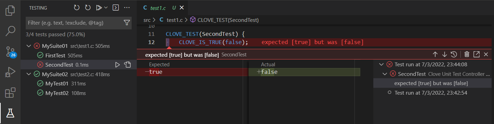
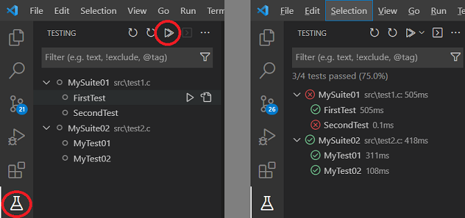

# CLove-Unit Testing Extension for VSCode

[](https://marketplace.visualstudio.com/items?itemName=fdefelici.vscode-clove-unit) [](https://marketplace.visualstudio.com/items?itemName=fdefelici.vscode-clove-unit)

The CLove-Unit Extension adds a UI boost for [CLove-Unit](https://github.com/fdefelici/clove-unit) C/C++ testing library.



> Still don't know about [CLove-Unit](https://github.com/fdefelici/clove-unit) testing library?<br />
> It's a Single Header Unit Testing library for C/C++ language, which make easy developer life. Give it a try! ;-)

## Extension Activation
In order to activate the extension:
1. First, you need to handle a C/C++ testing project using `CLove-Unit` following the library development [guidelines and samples](https://github.com/fdefelici/clove-unit). (This UI Extension doesn't include CLove-Unit library)
1. Then, create in your workspace the extension configuration file `.vscode/clove_unit_settings.json` (see `Extension Configuration`)
1. Finally, open the workspace folder with VSCode (if you created the configuration within VSCode IDE, make sure to close and re-open it)

## Extension Configuration
The extension needs the following configuration in the `.vscode/clove_unit_settings.json`

|Property|Description|
|--------|-----------|
| `testSourcesPath` | Workspace relative path to test sources |
| `buildCommand` | A shell command to build a test executable (OPTIONAL) |
| `testExecPath` | The path to the test executable |

## Extension Usage
Here an example of project developed with `CLove-Unit` library and related UI Extension Configuration.

> You can find this example project [here](./sample). 

### Filesystem
Project organization for this example:
```
.vscode/
	clove_unit_settings.json

bin/
	test.exe (produced when launching tests - see Configuration)

include/
	clove-unit.h (the library, you must include it by yourself)

src/
	test1.c
	test2.c
```

> NOTE: You can organize your project within the vscode workspace as you prefer. No constraints on this. 

### Configuration:
`.vscode/clove_unit_settings.json` configuration for this example:
```json
{
    "testSourcesPath" : "src",
    "buildCommand" : "clang -I include -o bin\\test.exe src\\*.c",
    "testExecPath" : "bin\\test.exe"
}
```
> NOTE: You can use your own configuration and preferred build command. In case, test project build is already managed by your IDE (or by other extensions) you can skip `buildCommand` configuration (either by removing the attribute or by configuring as an empty string).

### Test UI:
Test UI will appear like this:

